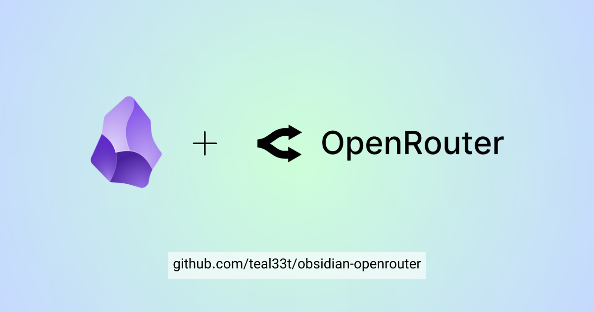
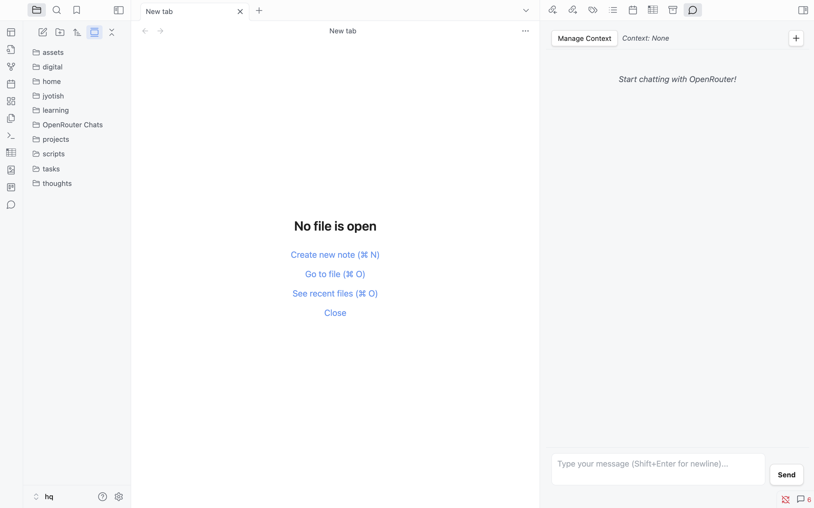
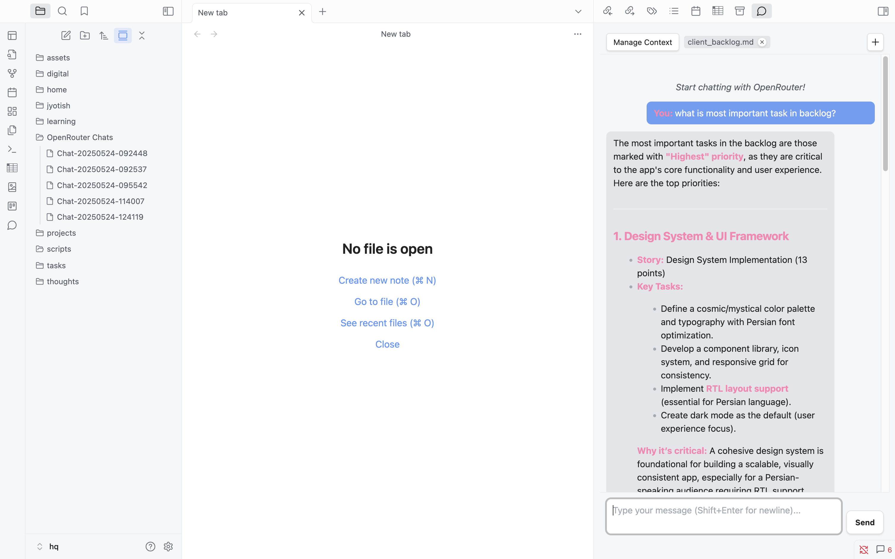
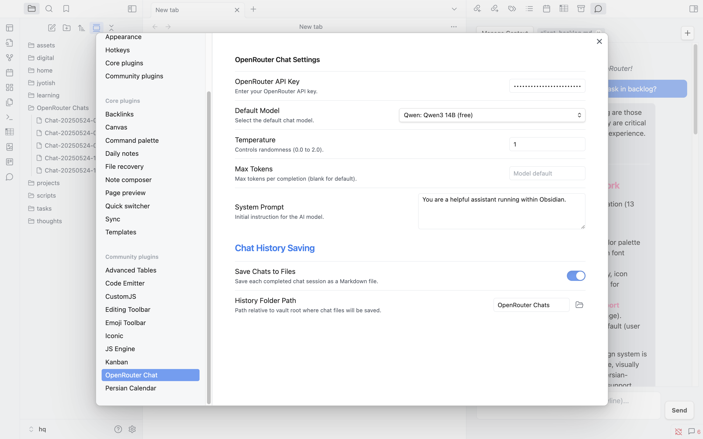
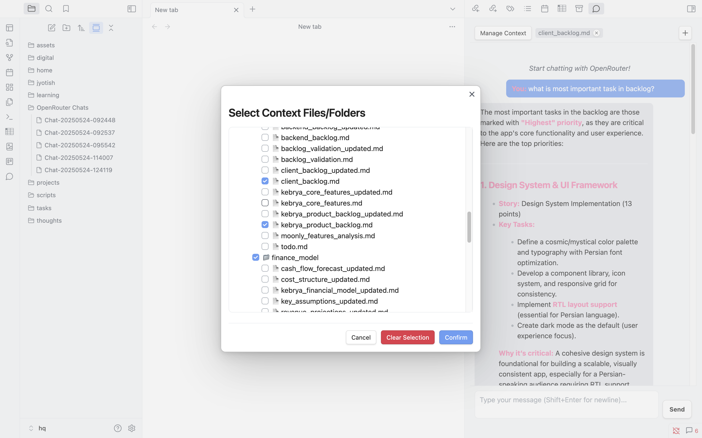

# Obsidian OpenRouter Chat

**Bring the power of diverse AI models from OpenRouter directly into your Obsidian vault!**

 

<!--  -->

---

Seamlessly chat with various large language models (LLMs) via the OpenRouter API without leaving your notes. Enhance your workflow by bringing AI assistance right where you think and write.

## 🚀 Features

*   💬 **Direct Chat Interface:** Interact with AI models in a dedicated chat view within Obsidian.
*   🔑 **OpenRouter Integration:** Connect securely using your OpenRouter API key.
*   🤖 **Model Selection:** Choose from a wide range of models available through OpenRouter.
*   🌡️ **Parameter Control:** Adjust Temperature and Max Tokens for tailored responses.
*   📝 **System Prompt:** Define a custom system prompt to guide the AI's behavior.
*   📚 **Flexible Context:** Select specific files or entire folders from your vault to provide context.
*   💾 **File-Based History:** Automatically save chat sessions as individual Markdown files in a designated folder within your vault.
*   🎨 **Theme-Aware UI:** Designed to blend in with your Obsidian theme.
*   ⚙️ **Easy Configuration:** Simple settings panel with a folder picker for history location.

## 📸 Screenshots

---

## 🛠️ Installation

### From Obsidian Community Plugins (Coming Soon!)

Once the plugin is accepted into the community plugin store:

1.  Go to `Settings` -> `Community plugins`.
2.  Ensure `Restricted mode` is **off**.
3.  Click `Browse` community plugins and search for "OpenRouter Chat".
4.  Click `Install`.
5.  Once installed, toggle the plugin **on** under the `Installed plugins` list.

### Manual Installation (Current Method)

1.  Download the latest `obsidian-openrouter.zip` file from the [Releases](https://github.com/teal33t/obsidian-openrouter/releases) page of this repository.
2.  Navigate to your Obsidian vault's plugins folder: `YourVault/.obsidian/plugins/`.
3.  Create a new folder named `obsidian-openrouter`.
4.  Unzip the downloaded `obsidian-openrouter.zip` file and place its contents (`main.js`, `manifest.json`, `styles.css`) inside the `obsidian-openrouter` folder.
5.  In Obsidian, go to `Settings` -> `Community plugins`.
6.  Ensure `Restricted mode` is **off**.
7.  Click the `Reload plugins` button (circular arrows).
8.  Find "OpenRouter Chat" in the list of installed plugins and toggle it **on**.

---

## ⚙️ Configuration

After installing and enabling the plugin:

1.  Go to `Settings` -> `OpenRouter Chat` (usually near the bottom of the left sidebar).
2.  **OpenRouter API Key:** Enter your API key obtained from [OpenRouter.ai](https://openrouter.ai/keys).
3.  **Default Model:** Select your preferred default chat model from the dropdown (models are fetched automatically after entering a valid API key).
4.  **Temperature:** Adjust the creativity/randomness of the AI's responses (0.0 - 2.0).
5.  **Max Tokens:** Set a limit on the length of the AI's response (leave blank for the model's default).
6.  **System Prompt:** Provide initial instructions to guide the AI's persona or task focus.
7.  **Save Chats to Files:** Toggle this **on** to enable saving chat history.
8.  **History Folder Path:** If saving is enabled, specify the folder within your vault where chat history files (`.md`) will be saved.
---

## 💡 Usage

1.  **Open the Chat View:**
    *   Click the message circle icon in the left ribbon.
    *   Use the command palette (`Ctrl/Cmd + P`) and search for "Open OpenRouter Chat".
2.  **Sending Messages:** Type your message in the input box at the bottom and press `Enter` (or click `Send`). Use `Shift + Enter` for newlines.
3.  **Managing Context:**
    *   Click the `Manage Context` button in the chat view header.
    *   Use the modal to select files and/or folders from your vault to include as context.
    *   Selected items appear as tags in the header. Click the `x` on a tag to remove it.
    *   The content of selected items will be sent to the AI along with your message.
4.  **Starting a New Chat / Saving History:**
    *   Click the `+` button in the chat view header.
    *   If `Save Chats to Files` is enabled in settings, the *current* chat session will be saved as a Markdown file in your specified history folder.
    *   The chat view will then be cleared, ready for a new conversation.

---

## 🤝 Contributing

Contributions, issues, and feature requests are welcome! Please feel free to check the [issues page](https://github.com/teal33t/obsidian-openrouter/issues).

## 📜 License

This plugin is released under the [MIT License](LICENSE).

## 🙏 Acknowledgements

*   Thanks to the [Obsidian Team](https://obsidian.md/) for creating such an extensible platform.
*   Powered by the [OpenRouter API](https://openrouter.ai/).

---

Enjoy chatting with AI in Obsidian! ✨

